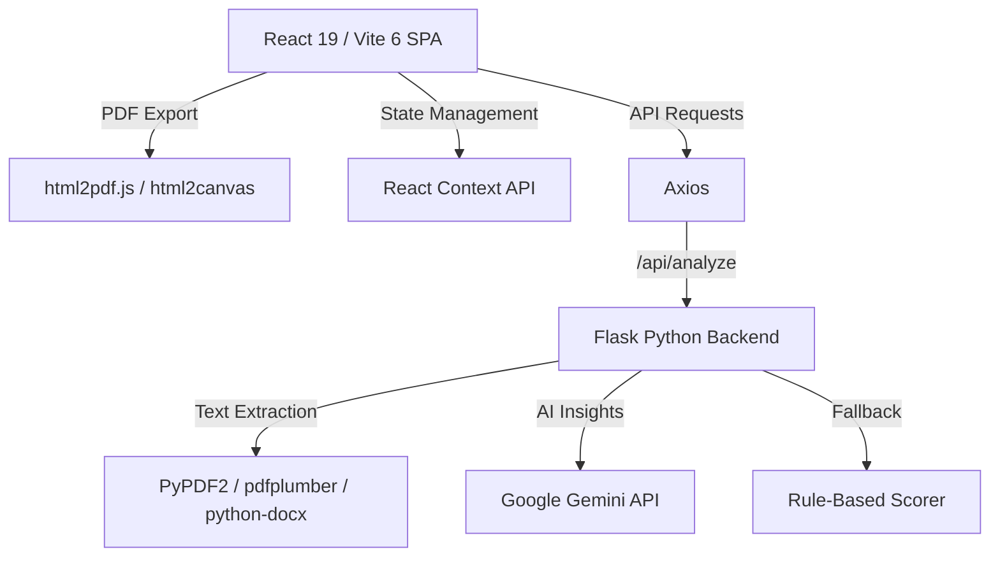

# 🚀 ResumeForge AI — ATS Resume Builder & Analyzer

> A modern, premium, and free online suite to build ATS-friendly resumes and analyze them instantly with Gemini AI-powered insights.

**Developed by Siddhesh Chavan** | [csiddhesh768@gmail.com](mailto:csiddhesh768@gmail.com) | [Portfolio](https://siddhesh-chavan-portfolio-flame.vercel.app/)

**Built for [Digital Heroes](https://digitalheroesco.com)** 🦸

---

## 📖 Project Overview

Writing and tuning resumes to pass Applicant Tracking Systems (ATS) is often tedious, slow, and hidden behind paywalls. **ResumeForge AI** solves this by providing a unified, fully free (₹0/$0 spent) developer-focused platform that offers:
1. **Resume Builder**: A live-rendering editor supporting professional templates, real-time PDF generation, and LaTeX code exporting.
2. **Resume Analyzer**: An AI-powered file parser that evaluates PDF/DOCX resumes, scores them across multiple categories, and gives specific keyword/ATS optimization advice.

---

## 🛠️ Tech Stack & Architecture



### Technical Specifications
* **Frontend**: React 19, Vite 6, React Router v7, Framer Motion (for physics-based smooth micro-animations).
* **Styling**: Vanilla CSS featuring a dark-themed glassmorphism layout, fluid hover states, and dynamic gradient glowing borders.
* **Backend**: Flask API, Gunicorn (production WSGI), Flask-CORS.
* **Parser Engines**: `pdfplumber` and `PyPDF2` (fallback) for accurate text coordinate extraction; `python-docx` for XML document processing.
* **AI Integration**: Google Gemini API (`gemini-2.0-flash`) using structured JSON responses with an integrated rule-based fallback model to ensure 100% service uptime even if the AI rate limit is reached.

---

## 🎨 UI/UX Features & Implementation Details

### 1. The Interactive Resume Builder (`/builder`)
* **Split-Screen Layout**: Features a form inputs panel on the left and a live-updating preview paper on the right.
* **Dynamic Style Theme Editor**: A Floating Action Button (FAB) toggles a customization drawer using Context API.
  * **Layout Switcher**: Dynamically binds `.template-classic` (centered, elegant lines) or `.template-modern` (asymmetric, left border, bold headers) classes to the container wrapper.
  * **Text Size Slider**: An interactive slider (range `8pt` to `14pt` with `0.5` steps) that adjusts root scaling in real-time.
  * **Color Customizers**: Color pickers update CSS Custom Properties (`--heading-color`, `--accent-color`) inside inline elements.
  * **Presets**: Offers 5 curated one-click color themes (Deep Dark, Emerald Forest, Midnight Royal, Amber Sunset, Minimal Slate).
* **LaTeX Code View**: Users can toggle from the `Preview` to `LaTeX Code` to view syntactically highlighted LaTeX code (via `react-syntax-highlighter`) ready to copy-paste into Overleaf.

### 2. The Resume Analyzer (`/analyzer`)
* **Drag-and-Drop Uploader**: An interactive dropzone styled with dashed border animations, processing file streams locally.
* **Dynamic Score Cards**: Interactive progress rings representing four key metrics:
  * **ATS Check**: Identifies sections, counts words, and flags non-standard headers.
  * **Content Quality**: Evaluates sentence structure, email validity, and action verbs.
  * **Technical Score**: Cross-references keywords against common tech stack templates.
  * **Formatting Score**: Audits structure completeness.
* **AI Accordion Feedback**: Collapsible cards displaying Gemini's parsed response outlining **Strengths**, **Weaknesses**, **ATS improvements**, and customized **Project & Skill feedback**.

---

## 🔬 How Key Components Were Implemented

### Clientside PDF Export (`html2pdf.js`)
Instead of server-side PDF compilation which can be resource-intensive, we use browser rendering.
We capture the preview DOM node (`#resume-preview`) and pass it to `html2pdf`. To guarantee that paper boundaries, margins, and section headings never break mid-page, we apply specific CSS print overrides:
```css
@media print {
  body { background: white; color: black; }
  .preview-container { box-shadow: none; margin: 0; padding: 0; }
  .page-break { page-break-before: always; }
}
```

### Fail-Safe AI Fallback Model
If the Gemini API key is missing or the external API request fails due to network/rate limits, the backend doesn't crash. It seamlessly triggers `_fallback_analysis` in [gemini_service.py](file:///e:/PROJECTS/Resume_generator/backend/services/gemini_service.py) which uses local regex rules to analyze the resume and returns standard formatted feedback structures instantly.

---

## 📦 Setup & Installation

### 1. Frontend

```bash
cd frontend
npm install
npm run dev
```
*Creates a local server at `http://localhost:5173/`.*

### 2. Backend

```bash
cd backend
python -m venv venv
venv\Scripts\activate       # On Windows
# source venv/bin/activate  # On Mac/Linux

pip install -r requirements.txt
cp .env.example .env        # Add your Gemini API key to .env
python app.py
```
*Creates a Flask API server at `http://localhost:5000/`.*

---

## 🌐 Production Deployment

### Frontend (Vercel)
1. Set the **Root Directory** to `frontend`.
2. Vercel automatically detects Vite and builds to `dist/`.
3. Add Environment Variable: `VITE_API_URL = https://your-backend.onrender.com`
4. Add the [vercel.json](file:///e:/PROJECTS/Resume_generator/frontend/vercel.json) rewrite rule to handle single-page routing (SPA fallback).

### Backend (Render)
1. Point your Render service to the dedicated backend repository: `https://github.com/Sidchav5/Resume_Backend`.
2. Render reads the [render.yaml](file:///e:/PROJECTS/Resume_generator/backend/render.yaml) blueprint:
   * **Build Command**: `pip install -r requirements.txt`
   * **Start Command**: `gunicorn app:create_app()`
3. In the Render Dashboard settings, add your `GEMINI_API_KEY` environment variable.

---

## 📄 License

This project is licensed under the MIT License.

**Built for [Digital Heroes](https://digitalheroesco.com)** 🦸
